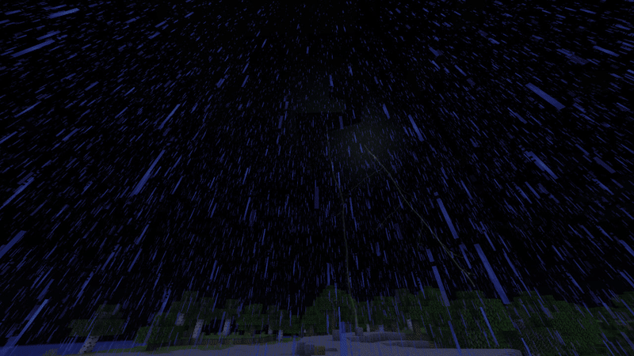
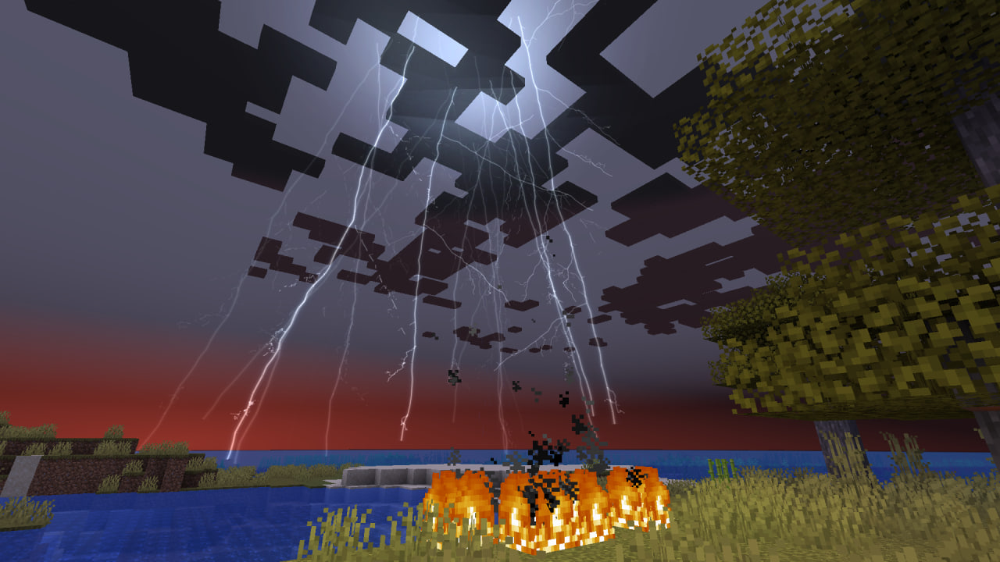
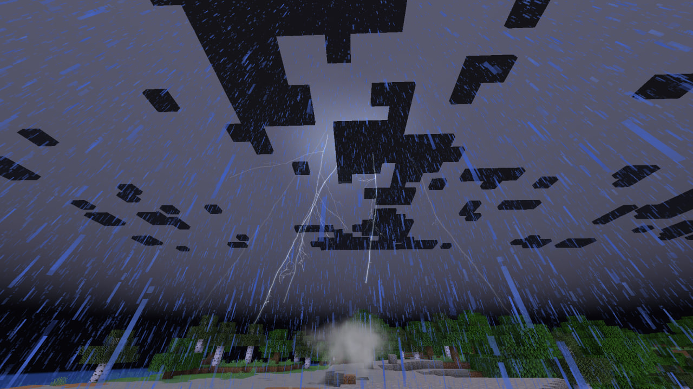
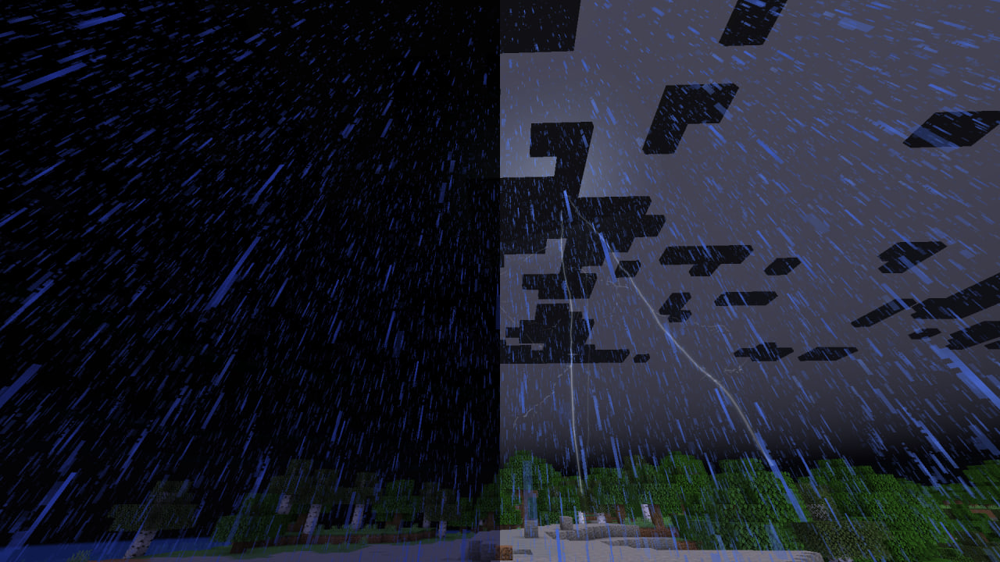
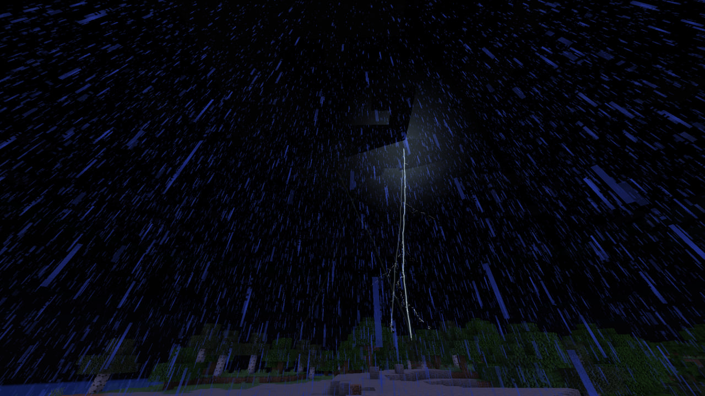

# Thunderhead

> **Turn every thunderstorm into a spectacle.**



Thunderhead is a cinematic lightning overhaul for Minecraft 1.21.1. Every strike becomes a complete event: a towering procedural channel, a cold exposure flash, a pressure wave, sparks, debris, smoke or water spray — followed by layered thunder delayed by distance.

## Highlights

- Huge seeded lightning channels with dynamic, tapered branching
- Five discharge archetypes — negative and positive cloud-to-ground, cloud-to-cloud, intracloud, megaflash
- Rare positive superbolts: wider, violet, almost unbranched, one stroke that holds
- A storm that stays electrically alive between ground strikes, with clouds lit from within
- Red sprites and blue jets above severe storms, from their real morphology
- Multi-stroke flashes and storm-front lightning across the horizon
- Shockwaves, impact bursts, smoke, sparks, debris, ash, steam and water spray
- Transient scene illumination without chunk relighting
- Custom thunder scheduled at the speed of sound
- Low/Medium/High/Ultra presets, LOD and hard effect budgets
- Reduced-flashing and independent camera/flash controls
- Fabric and NeoForge from one shared codebase
- No external shader pack required

## Gallery

| Procedural branching | Close impact |
| --- | --- |
|  |  |

| Transient illumination | Night strike |
| --- | --- |
|  |  |

## Installation

Requirements:

- Minecraft 1.21.1
- Java 21
- Fabric Loader 0.16.14+ and Fabric API, **or** NeoForge 21.1+

Download the jar for exactly one loader and place it in the instance's `mods` directory.

| Where Thunderhead is installed | Available features |
| --- | --- |
| Client only | All lightning visuals, particles, illumination, custom thunder and camera effects. Works while joining a server without the mod. |
| Client and server | Everything above, plus configurable near-miss damage and rare ball lightning. |

## What Thunderhead does not replace

Vanilla lightning damage inside its original strike box, fire, lightning rods, copper weathering and mob conversions remain vanilla behavior. Optional server gameplay extends the event outside that box and can be disabled.

## Configuration

`config/tempestfx.json` controls visuals, audio, accessibility and performance. `config/tempestfx-server.json` controls near-miss damage and ball lightning.

The most useful starting points are:

- `performance.qualityPreset`: `LOW`, `MEDIUM`, `HIGH`, `ULTRA`
- `general.reducedFlashing`: removes flicker and return strokes and caps exposure
- `camera.screenFlash` / `camera.cameraImpulse`: independent comfort toggles
- `audio.realisticSoundDelay`: distance-based thunder timing
- `performance.maxParticles`, `renderDistance`, `lod`, `maxConcurrentEffects`: hard performance controls

Minecraft's **Hide Lightning Flashes** setting is respected.

## Showcase commands

These client commands create visual-only strikes and are intended for development/capture:

```text
/tempestfx strike
/tempestfx strike 40
/tempestfx strike 120 72 -35
/tempestfx strike --seed 12345
/tempestfx strike 120 72 -35 --seed 12345
/tempestfx strike water --seed 12345
/tempestfx strike-camera 20 --seed 12345
```

Capture preset:

```text
/tempestfx camera cinematic
/tempestfx camera speed 0.06
/tempestfx camera off
```

The cinematic preset uses vanilla spectator mode, hides the HUD, disables bobbing and enables smooth camera. It needs command permission in the showcase world and never changes tick speed.

Gameplay test commands:

```text
/tempestfx summon
/tempestfx ball
```

These route through server commands and need normal command permission.

## Rendering compatibility

External shader packs are not required, and do not change how the effect looks. Thunderhead compiles its own GLSL programs and draws the effect into a framebuffer of its own, then applies it after the game and any pack have finished the scene image. Depth for occlusion is borrowed from the frame itself, so terrain, water and entities hide the effect correctly in any pipeline.

Verified with Iris 1.8.12 under Complementary Unbound r5.8.1 and ARTShade V0.3.0FIX. See `release/compatibility.md` for the exact manual test status; OptiFine is untested rather than unsupported.

## Building

```powershell
$env:JAVA_HOME = 'C:\path\to\jdk-21'
.\gradlew.bat clean buildAll
```

Artifacts:

- `fabric/build/libs/thunderhead-fabric-1.3.0.jar`
- `neoforge/build/libs/thunderhead-neoforge-1.3.0.jar`

See [BUILDING.md](../../BUILDING.md) for development runs and test scope, and [ARCHITECTURE.md](../../ARCHITECTURE.md) for implementation details.

## License

Code and generated assets are available under the [MIT License](../../LICENSE). Asset provenance is documented in `common/src/main/resources/assets/tempestfx/ASSET_LICENSE.md`.

## For mod developers

Thunderhead exposes a small client-side API — raise your own lightning, style it per strike, or
listen for every strike the mod draws. See [API.md](API.md).
